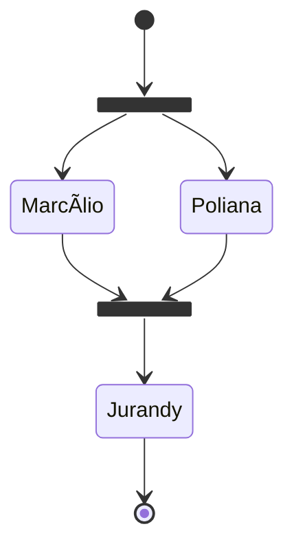

# Diagramas

```mermaid
stateDiagram-v2
  state fork_state <<fork>>
    [*] --> fork_state
    fork_state --> Marcílio
    fork_state --> Poliana

    state join_state <<join>>
    Marcílio --> join_state
    Poliana --> join_state
    join_state --> Jurandy
    Jurandy --> [*]
```